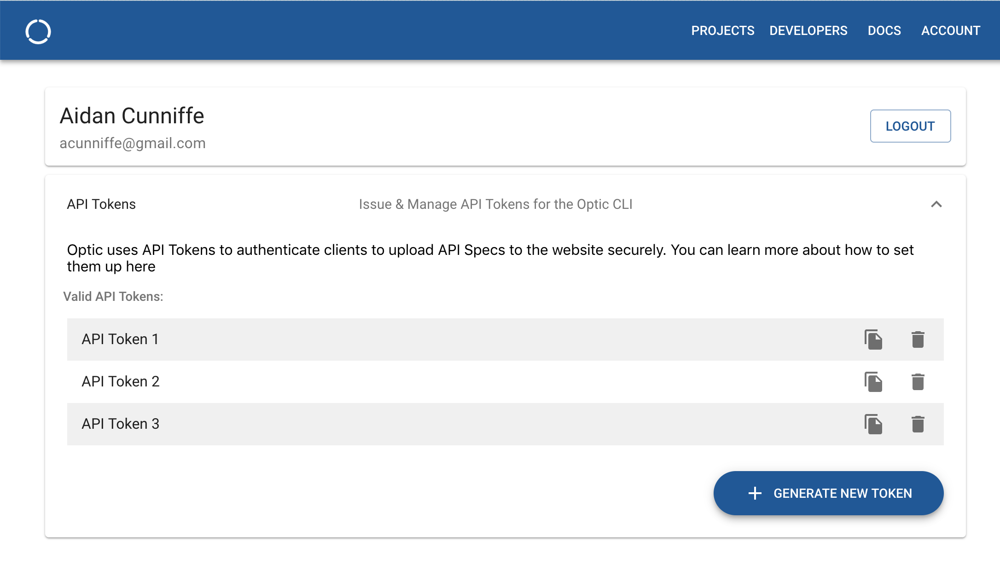

# Quick Start
> In this tutorial you'll learn how to install Optic and use it to automatically document a REST API written in Node. 

### Install Optic CLI
Optic is a CLI tool that runs your API Tests through a local proxy server. By observing the behavior of your API as it interacts with your test data, the proxy server can output an accurate API Spec.

1. Install Optic CLI globally using an up-to-date version of NPM  
```bash
npm install @useoptic/cli -g
```

### Download the Example Project
2. Clone the example project repo from our GitHub. This project contains a simple Express-JS API that implements user creation, login, and functionality to follow/unfollow other users. 
```bash
git clone https://github.com/opticdev/optic-tutorial-example.git
``` 
3. Install project dependencies
 ```bash
cd optic-tutorial-example
npm install
```

4. Verify that you can run the API's tests
```bash
npm run test
```

### Explore the 'optic.yml' file
For every API you want Optic to document you'll need to create an `optic.yml` file. The example project already includes one, but it's helpful to review it before proceeding further. 

```yaml
strategy:
  type: logging
  # The command that runs our tests
  commandToRun: npm run test
api:
  # The name of the API on Optic
  id: example-app
  security:
    - type: bearer
  # The paths you'd like Optic to document
  paths:
    - /users
    - /users/login
    - /users/:userId/followers

``` 

### Document the API Contract
5. Run `optic api:document` from the root directory of the API (same directory as the optic.yml file).

```bash
testuser$ optic api:document
Collecting API Interactions:...
I documented 4 endpoints by observing 11 requests!
Generating reports...... Done!
``` 

### Uploading to Optic 
We recommend uploading your API contracts to the Optic Webapp. 
- We provide a rich GUI for your automatically generated docs 
- The ability to share API Contracts with your entire team. We offer a granular permissions on a per/user, per/api basis.  
- An automated pipeline to generate client SDKs for the API
- API search functionality 
- An automatically generated API changelog 

Here's a preview of the API console for the example project:


#### Linking an Optic Account to the CLI
1. Login to Optic by [clicking here](https://app.useoptic.com/#/login). You can choose to login with your Google, BitBucket or GitHub account. 

2. Once logged in click **Account**
3. Expand the **API Tokens** Panel and click **Generate New Token**. Copy the Token to your clipboard. This is used to authenticate the CLI. 

4. Run `optic adduser` and paste the API Token from the account page 
```bash
testuser$ optic adduser
Generate a new token or copy one from useoptic.com. Navigating to account page now...
? Paste your API Token: {paste token here} 
```

#### Publishing API Spec to Optic
1. Click on **Projects** in the navigation bar
2. Click **Add API** and create an API named "example-api" (same as 'name' in the optic.yml)
3. Run `optic api:publish` to run tests and upload the API Spec to Optic. When the tests complete a new browser window will open and navigate to the API Console in the webapp. 

## Next Steps
Nice work! You just learned how to automatically document APIs with Optic. Now it's time to try it with your own code. Here are the next docs you should take a look at: 

- [Setting up your own projects](/setup/project-setup)
- [Testing Guidelines](/setup/testing-guidelines)

If you have any questions reach out to us on Drift (chat widget in the bottom right of your screen). 
