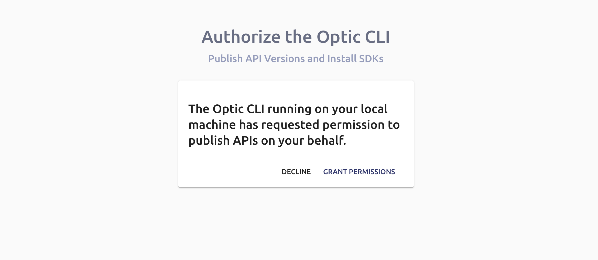

# Installing Optic
To start, install our CLI from NPM.

```bash
npm install @useoptic/cli -g
``` 

## Logging in from the CLI
To login to your Optic Account from the CLI, just run: 
```bash
optic auth:login
``` 

A browser window will open asking you to authorize the CLI. Click 'Grant Permissions'.


**That's it! You are ready to start using Optic!**
